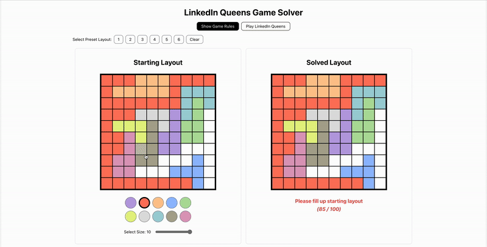

# LinkedIn Queens Game Solver

This application is a solver for the LinkedIn Queens Game, a puzzle where the objective is to place queens on a chessboard such that no two queens threaten each other.

The solver utilizes algorithms to explore possible configurations and find a valid arrangement of queens. Users can interact with the app to get the solution for the current puzzle.

## Use the solver

https://linkedin-queens-game-solver.adriangohjw.com/

## How to run locally

`npm start`

Runs the app in the development mode.\
Open [http://localhost:3000](http://localhost:3000) to view it in the browser.

The page will reload if you make edits.\
You will also see any lint errors in the console.
